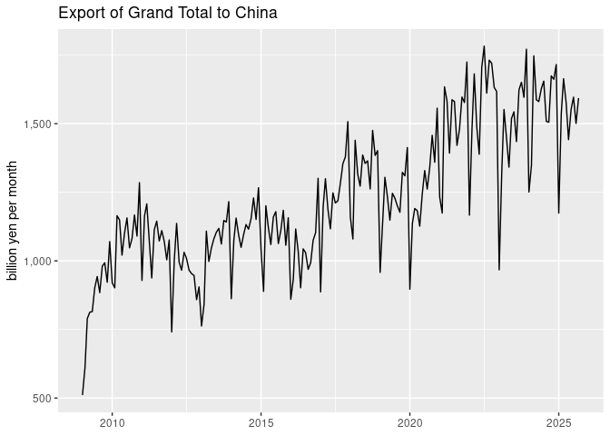
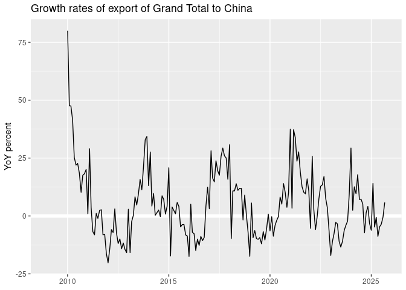

Japan international trade
================
Mitsuo Shiota
2019-05-30

-   [Summary](#summary)
-   [Function](#function)
-   [Download](#download)
-   [Charts](#charts)
-   [Save data in a rdata file](#save-data-in-a-rdata-file)

<!-- badges: start -->

[](https://github.com/mitsuoxv/jp-trade/actions)
<!-- badges: end -->

Updated: 2021-04-28

## Summary

<https://mitsuoxv.shinyapps.io/jp-trade/>

I download Japan international trade monthly data from January 2009,
make them tidy, and save them to use for Shiny app. And I have created
the Shiny app above.

## Function

[e-Stat](https://www.e-stat.go.jp/en) provides summarized data as csv
files in its [export
page](https://www.e-stat.go.jp/stat-search/files?page=1&layout=datalist&toukei=00350300&bunya_l=16&tstat=000001013137&cycle=1&tclass1=000001013260&tclass2=000001013261&second2=1)
and [import
page](https://www.e-stat.go.jp/stat-search/files?page=1&layout=datalist&toukei=00350300&bunya_l=16&tstat=000001013137&cycle=1&tclass1=000001013260&tclass2=000001013262&second2=1).

The format of a csv file is a vertically stacked list of 12 monthly plus
one annual data, whose rows are areas, columns are goods, and numbers
are thousand yen. The number of areas of export changes from 51 to 53 in
April 2017. I have made read\_url\_year function to download a csv file,
read it, delete non-data rows, add month column, delete annual data, and
make it tidy.

``` r
read_url_year <- function(url, year, n_area, start_month = 1) {
  # download
  tf <- tempfile(fileext = ".csv")
  
  httr::GET(url, httr::write_disk(tf))
  
  # read
  data_txt <- readLines(tf)
  
  if (str_detect(data_txt[1], ",")) {
    data <- read_csv(data_txt, skip = 1, col_types = cols(.default = col_character()))
  } else {
    data_csv <- data_txt[str_detect(data_txt, ",")]
    data <- read_csv(data_csv, col_types = cols(.default = col_character()))
  }

  # delete non-data rows
  data <- data %>% 
    filter(`Exp or Imp` %in% c("1", "2"))
  
  # add month column
  n_months <- nrow(data) / n_area
  
  data$month <- rep(start_month:(start_month + n_months - 1), each = n_area)
  
  # delete annual data, and make it tidy
  data %>% 
    filter(month != 13) %>% 
    mutate(month = make_date(year, month, 1)) %>% 
    pivot_longer(!c(1:2, month), names_to = "goods", values_to = "value") %>% 
    mutate(
      value = as.numeric(value),
      goods = str_to_title(goods),
      Area = ifelse(Area %in% c("USA", "EU"), Area, str_to_title(Area))
      )
}
```

## Download

I have to know statInfId number to download through REST API
<https://www.e-stat.go.jp/stat-search/file-download>. I have tried
estat\_getDataCatalog function in [estatapi
package](https://cran.rstudio.com/web/packages/estatapi/estatapi.pdf),
but failed. So I manually get them from CSV mark in [each
page](https://www.e-stat.go.jp/stat-search/files?page=1&layout=datalist&toukei=00350300&bunya_l=16&tstat=000001013137&cycle=1&year=20190&month=12040604&tclass1=000001013260&tclass2=000001013261&result_back=1&second2=1).
I have found statInfId numbers in import are one plus those in export.

After I download data, I have combined them into one data frame, and
transformed values from thousand to billion yen.

Added areas of export in April 2017 are:

    ## [1] "Vietnam" "Qatar"

## Charts

I have drawn charts of export to China, as an example.

<!-- --><!-- -->

## Save data in a rdata file

I save necessary data in a rdata file to use for Shiny app.

``` r
# add gr (growth rates on year-over-year basis)
trade <- trade %>% 
  group_by(ex_im, area, goods) %>% 
  arrange(month) %>% 
  mutate(
    lag_12 = lag(value, 12),
    gr = (value / lag_12) - 1
  ) %>% 
  ungroup() %>% 
  select(-lag_12)

# annual data
trade_year <- trade %>% 
  mutate(year = year(month)) %>% 
  group_by(ex_im, area, goods, year) %>% 
  summarize(value = sum(value), .groups = "drop")

# prepare menus
levels_area <- trade$area %>% unique() %>% sort()
levels_goods <- trade$goods %>% unique()

usethis::use_data(trade, trade_year, levels_area, levels_goods, overwrite = TRUE)
```

EOL
